<p align="center">
  
</p>

[](https://github.com/adenhq/hive/blob/main/LICENSE)
[](https://www.ycombinator.com/companies/aden)
[](https://hub.docker.com/u/adenhq)
[](https://discord.com/invite/MXE49hrKDk)
[](https://x.com/aden_hq)
[](https://www.linkedin.com/company/teamaden/)

<p align="center">
  
  
  
  
  
</p>
<p align="center">
  
  
  
  
</p>

## Overview

Build reliable, self-improving AI agents without hardcoding workflows. Define your goal through conversation with a coding agent, and the framework generates a node graph with dynamically created connection code. When things break, the framework captures failure data, evolves the agent through the coding agent, and redeploys. Built-in human-in-the-loop nodes, credential management, and real-time monitoring give you control without sacrificing adaptability.

Visit [adenhq.com](https://adenhq.com) for complete documentation, examples, and guides.

## Quick Links

- **[Documentation](https://docs.adenhq.com/)** - Complete guides and API reference
- **[Self-Hosting Guide](https://docs.adenhq.com/getting-started/quickstart)** - Deploy Hive on your infrastructure
- **[Changelog](https://github.com/adenhq/hive/releases)** - Latest updates and releases
<!-- - **[Roadmap](https://adenhq.com/roadmap)** - Upcoming features and plans -->
- **[Report Issues](https://github.com/adenhq/hive/issues)** - Bug reports and feature requests

## Quick Start

### Prerequisites

- [Docker](https://docs.docker.com/get-docker/) (v20.10+)
- [Docker Compose](https://docs.docker.com/compose/install/) (v2.0+)

### Installation

```bash
# Clone the repository
git clone https://github.com/adenhq/hive.git
cd hive

# Copy and configure
cp config.yaml.example config.yaml

# Run setup and start services
npm run setup
docker compose up
```

**Access the application:**

- Dashboard: http://localhost:3000
- API: http://localhost:4000
- Health: http://localhost:4000/health

## Features

- **Goal-Driven Development** - Define objectives in natural language; the coding agent generates the agent graph and connection code to achieve them
- **Self-Adapting Agents** - Framework captures failures, updates objectives and updates the agent graph
- **Dynamic Node Connections** - No predefined edges; connection code is generated by any capable LLM based on your goals
- **SDK-Wrapped Nodes** - Every node gets shared memory, local RLM memory, monitoring, tools, and LLM access out of the box
- **Human-in-the-Loop** - Intervention nodes that pause execution for human input with configurable timeouts and escalation
- **Real-time Observability** - WebSocket streaming for live monitoring of agent execution, decisions, and node-to-node communication
- **Cost & Budget Control** - Set spending limits, throttles, and automatic model degradation policies
- **Production-Ready** - Self-hostable, built for scale and reliability

## Why Aden

Traditional agent frameworks require you to manually design workflows, define agent interactions, and handle failures reactively. Aden flips this paradigm—**you describe outcomes, and the system builds itself**.

```mermaid
flowchart LR
    subgraph BUILD["🏗️ BUILD"]
        GOAL["Define Goal<br/>+ Success Criteria"] --> NODES["Add Nodes<br/>LLM/Router/Function"]
        NODES --> EDGES["Connect Edges<br/>on_success/failure/conditional"]
        EDGES --> TEST["Test & Validate"] --> APPROVE["Approve & Export"]
    end

    subgraph EXPORT["📦 EXPORT"]
        direction TB
        JSON["agent.json<br/>(GraphSpec)"]
        TOOLS["tools.py<br/>(Functions)"]
        MCP["mcp_servers.json<br/>(Integrations)"]
    end

    subgraph RUN["🚀 RUNTIME"]
        LOAD["AgentRunner<br/>Load + Parse"] --> SETUP["Setup Runtime<br/>+ ToolRegistry"]
        SETUP --> EXEC["GraphExecutor<br/>Execute Nodes"]

        subgraph DECISION["Decision Recording"]
            DEC1["runtime.decide()<br/>intent → options → choice"]
            DEC2["runtime.record_outcome()<br/>success, result, metrics"]
        end
    end

    subgraph INFRA["⚙️ INFRASTRUCTURE"]
        CTX["NodeContext<br/>memory • llm • tools"]
        STORE[("FileStorage<br/>Runs & Decisions")]
    end

    APPROVE --> EXPORT
    EXPORT --> LOAD
    EXEC --> DECISION
    EXEC --> CTX
    DECISION --> STORE
    STORE -.->|"Analyze & Improve"| NODES

    style BUILD fill:#ffbe42,stroke:#cc5d00,stroke-width:3px,color:#333
    style EXPORT fill:#fff59d,stroke:#ed8c00,stroke-width:2px,color:#333
    style RUN fill:#ffb100,stroke:#cc5d00,stroke-width:3px,color:#333
    style DECISION fill:#ffcc80,stroke:#ed8c00,stroke-width:2px,color:#333
    style INFRA fill:#e8763d,stroke:#cc5d00,stroke-width:3px,color:#fff
    style STORE fill:#ed8c00,stroke:#cc5d00,stroke-width:2px,color:#fff
```



### The Aden Advantage

| Traditional Frameworks | Aden |
|------------------------|------|
| Hardcode agent workflows | Describe goals in natural language |
| Manual graph definition | Auto-generated agent graphs |
| Reactive error handling | Proactive self-evolution |
| Static tool configurations | Dynamic SDK-wrapped nodes |
| Separate monitoring setup | Built-in real-time observability |
| DIY budget management | Integrated cost controls & degradation |

### How It Works

1. **Define Your Goal** → Describe what you want to achieve in plain English
2. **Coding Agent Generates** → Creates the agent graph, connection code, and test cases
3. **Workers Execute** → SDK-wrapped nodes run with full observability and tool access
4. **Control Plane Monitors** → Real-time metrics, budget enforcement, policy management
5. **Self-Improve** → On failure, the system evolves the graph and redeploys automatically

## How Aden Compares

Aden takes a fundamentally different approach to agent development. While most frameworks require you to hardcode workflows or manually define agent graphs, Aden uses a **coding agent to generate your entire agent system** from natural language goals. When agents fail, the framework doesn't just log errors—it **automatically evolves the agent graph** and redeploys.

### Comparison Table

| Framework | Category | Approach | Aden Difference |
|-----------|----------|----------|-----------------|
| **LangChain, LlamaIndex, Haystack** | Component Libraries | Predefined components for RAG/LLM apps; manual connection logic | Generates entire graph and connection code upfront |
| **CrewAI, AutoGen, Swarm** | Multi-Agent Orchestration | Role-based agents with predefined collaboration patterns | Dynamically creates agents/connections; adapts on failure |
| **PydanticAI, Mastra, Agno** | Type-Safe Frameworks | Structured outputs and validation for known workflows | Evolving workflows; structure emerges through iteration |
| **Agent Zero, Letta** | Personal AI Assistants | Memory and learning; OS-as-tool or stateful memory focus | Production multi-agent systems with self-healing |
| **CAMEL** | Research Framework | Emergent behavior in large-scale simulations (up to 1M agents) | Production-oriented with reliable execution and recovery |
| **TEN Framework, Genkit** | Infrastructure Frameworks | Real-time multimodal (TEN) or full-stack AI (Genkit) | Higher abstraction—generates and evolves agent logic |
| **GPT Engineer, Motia** | Code Generation | Code from specs (GPT Engineer) or "Step" primitive (Motia) | Self-adapting graphs with automatic failure recovery |
| **Trading Agents** | Domain-Specific | Hardcoded trading firm roles on LangGraph | Domain-agnostic; generates structures for any use case |

### When to Choose Aden

Choose Aden when you need:
- Agents that **self-improve from failures** without manual intervention
- **Goal-driven development** where you describe outcomes, not workflows
- **Production reliability** with automatic recovery and redeployment
- **Rapid iteration** on agent architectures without rewriting code
- **Full observability** with real-time monitoring and human oversight

Choose other frameworks when you need:
- **Type-safe, predictable workflows** (PydanticAI, Mastra)
- **RAG and document processing** (LlamaIndex, Haystack)
- **Research on agent emergence** (CAMEL)
- **Real-time voice/multimodal** (TEN Framework)
- **Simple component chaining** (LangChain, Swarm)

## Project Structure

```
hive/
├── honeycomb/              # Frontend Dashboard 
├── hive/                   # Backend API Server 
├── aden-tools/             # MCP Tools Package - 19 tools for agent capabilities
├── docs/                   # Documentation and guides
├── scripts/                # Build and utility scripts
├── config.yaml.example     # Configuration template
├── docker-compose.yml      # Container orchestration
├── DEVELOPER.md            # Developer guide
├── CONTRIBUTING.md         # Contribution guidelines
└── ROADMAP.md              # Product roadmap
```

## Development

### Local Development with Hot Reload

```bash
# Copy development overrides
cp docker-compose.override.yml.example docker-compose.override.yml

# Start with hot reload enabled
docker compose up
```

### Running Without Docker

```bash
# Install dependencies
npm install

# Generate environment files
npm run generate:env

# Start frontend (in honeycomb/)
cd honeycomb && npm run dev

# Start backend (in hive/)
cd hive && npm run dev
```

## Documentation

- **[Developer Guide](DEVELOPER.md)** - Comprehensive guide for developers
- [Getting Started](docs/getting-started.md) - Quick setup instructions
- [Configuration Guide](docs/configuration.md) - All configuration options
- [Architecture Overview](docs/architecture.md) - System design and structure

## Roadmap

Aden Agent Framework aims to help developers build outcome oriented, self-adaptive agents. Please find our roadmap here

[ROADMAP.md](ROADMAP.md)


## Community & Support

We use [Discord](https://discord.com/invite/MXE49hrKDk) for support, feature requests, and community discussions.

- Discord - [Join our community](https://discord.com/invite/MXE49hrKDk)
- Twitter/X - [@adenhq](https://x.com/aden_hq)
- LinkedIn - [Company Page](https://www.linkedin.com/company/teamaden/)

## Contributing

We welcome contributions! Please see [CONTRIBUTING.md](CONTRIBUTING.md) for guidelines.

1. Fork the repository
2. Create your feature branch (`git checkout -b feature/amazing-feature`)
3. Commit your changes (`git commit -m 'Add amazing feature'`)
4. Push to the branch (`git push origin feature/amazing-feature`)
5. Open a Pull Request

## Join Our Team

**We're hiring!** Join us in engineering, research, and go-to-market roles.

[View Open Positions](https://jobs.adenhq.com/a8cec478-cdbc-473c-bbd4-f4b7027ec193/applicant)

## Security

For security concerns, please see [SECURITY.md](SECURITY.md).

## License

This project is licensed under the Apache License 2.0 - see the [LICENSE](LICENSE) file for details.

## Frequently Asked Questions (FAQ)

**Q: Does Aden depend on LangChain or other agent frameworks?**

No. Aden is built from the ground up with no dependencies on LangChain, CrewAI, or other agent frameworks. The framework is designed to be lean and flexible, generating agent graphs dynamically rather than relying on predefined components.

**Q: What LLM providers does Aden support?**

Aden supports 100+ LLM providers through LiteLLM integration, including OpenAI (GPT-4, GPT-4o), Anthropic (Claude models), Google Gemini, Mistral, Groq, and many more. Simply set the appropriate API key environment variable and specify the model name.

**Q: Can I use Aden with local AI models like Ollama?**

Yes! Aden supports local models through LiteLLM. Simply use the model name format `ollama/model-name` (e.g., `ollama/llama3`, `ollama/mistral`) and ensure Ollama is running locally.

**Q: What makes Aden different from other agent frameworks?**

Aden generates your entire agent system from natural language goals using a coding agent—you don't hardcode workflows or manually define graphs. When agents fail, the framework automatically captures failure data, evolves the agent graph, and redeploys. This self-improving loop is unique to Aden.

**Q: Is Aden open-source?**

Yes, Aden is fully open-source under the Apache License 2.0. We actively encourage community contributions and collaboration.

**Q: Does Aden collect data from users?**

Aden collects telemetry data for monitoring and observability purposes, including token usage, latency metrics, and cost tracking. Content capture (prompts and responses) is configurable and stored with team-scoped data isolation. All data stays within your infrastructure when self-hosted.

**Q: What deployment options does Aden support?**

Aden supports Docker Compose deployment out of the box, with both production and development configurations. Self-hosted deployments work on any infrastructure supporting Docker. Cloud deployment options and Kubernetes-ready configurations are on the roadmap.

**Q: Can Aden handle complex, production-scale use cases?**

Yes. Aden is explicitly designed for production environments with features like automatic failure recovery, real-time observability, cost controls, and horizontal scaling support. The framework handles both simple automations and complex multi-agent workflows.

**Q: Does Aden support human-in-the-loop workflows?**

Yes, Aden fully supports human-in-the-loop workflows through intervention nodes that pause execution for human input. These include configurable timeouts and escalation policies, allowing seamless collaboration between human experts and AI agents.

**Q: What monitoring and debugging tools does Aden provide?**

Aden includes comprehensive observability features: real-time WebSocket streaming for live agent execution monitoring, TimescaleDB-powered analytics for cost and performance metrics, health check endpoints for Kubernetes integration, and 19 MCP tools for budget management, agent status, and policy control.

**Q: What programming languages does Aden support?**

Aden provides SDKs for both Python and JavaScript/TypeScript. The Python SDK includes integration templates for LangGraph, LangFlow, and LiveKit. The backend is Node.js/TypeScript, and the frontend is React/TypeScript.

**Q: Can Aden agents interact with external tools and APIs?**

Yes. Aden's SDK-wrapped nodes provide built-in tool access, and the framework supports flexible tool ecosystems. Agents can integrate with external APIs, databases, and services through the node architecture.

**Q: How does cost control work in Aden?**

Aden provides granular budget controls including spending limits, throttles, and automatic model degradation policies. You can set budgets at the team, agent, or workflow level, with real-time cost tracking and alerts.

**Q: Where can I find examples and documentation?**

Visit [docs.adenhq.com](https://docs.adenhq.com/) for complete guides, API reference, and getting started tutorials. The repository also includes documentation in the `docs/` folder and a comprehensive [DEVELOPER.md](DEVELOPER.md) guide.

**Q: How can I contribute to Aden?**

Contributions are welcome! Fork the repository, create your feature branch, implement your changes, and submit a pull request. See [CONTRIBUTING.md](CONTRIBUTING.md) for detailed guidelines.

**Q: Does Aden offer enterprise support?**

For enterprise inquiries, contact the Aden team through [adenhq.com](https://adenhq.com) or join our [Discord community](https://discord.com/invite/MXE49hrKDk) for support and discussions.

---

<p align="center">
  Made with 🔥 Passion in San Francisco
</p>
